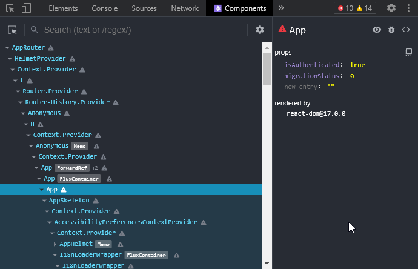
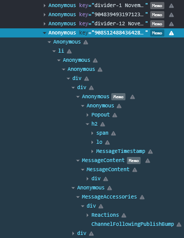
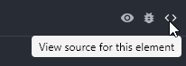
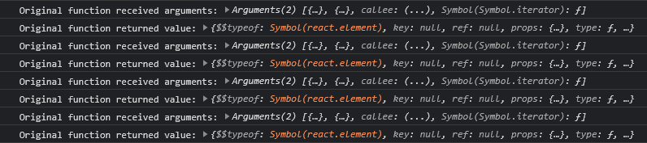

<Banner type="warn" bold>

This article assumes you are familiar with modern [JavaScript](https://developer.mozilla.org/en-US/docs/Web/JavaScript)
as well as [React](https://reactjs.org) and [JSX](https://reactjs.org/docs/introducing-jsx.html)!

</Banner>

## Environment
As you may already know, the Discord desktop application uses [Electron](https://www.electronjs.org).
The UI is created using [React](https://reactjs.org) and all of the data is handled by a custom event system and a custom [Flux](https://facebook.github.io/flux/) implementation.
Their source is most likely written in [TypeScript](https://www.typescriptlang.org), however that is mostly irrelevant for plugin development.
Everything is transpiled and then bundled together using [webpack](https://webpack.js.org).

Since it is based on [Chromium](https://www.chromium.org/Home), Electron's renderer window has the [Chrome DevTools](https://developer.chrome.com/docs/devtools/).
You can access them by pressing `Ctrl` + `Shift` + `I` (or `Cmd` + `Opt` + `I` on a Mac).
The dev tools will be **extremely important** for any kind of reverse engineering later on and can be used to experiment in the console.

## React Dev Tools
React Developer Tools extends the regular dev tools with React specific tabs.
If you have debugged a React application before, you should be familiar with them.
They will be very helpful when working with Discord's own React components.

In order to use them in Discord, you will need to have a [Chrome](https://www.google.com/intl/en_us/chrome/) installation on your computer.
Install the [React Developer Tools extension](https://chrome.google.com/webstore/detail/react-developer-tools/fmkadmapgofadopljbjfkapdkoienihi/) from the Chrome Web Store.
Then enable the setting in BetterDiscord's developer settings and the dev tools will automatically be loaded in Discord as well.



## BetterDiscord API
[BetterDiscord](https://betterdiscord.app)'s full API will **not** be covered here in details.
**Read the detailed entry on [Creating Plugins](https://github.com/BetterDiscord/BetterDiscord/wiki/Creating-Plugins) in the wiki on the BetterDiscord repo.**
If you encounter any outdated or unclear parts, you should ask in the [BetterDiscord server](https://discord.gg/0Tmfo5ZbORCRqbAd).

A basic BetterDiscord plugin template could look something like this:

```js
/**
 * @name MyPlugin
 * @author YourName
 * @version 0.1.0
 * @description What the plugin does.
 */

module.exports = class MyPlugin {
    start() {
        // do something on plugin start
    }
    stop() {
        // do something on plugin stop
    }
};
```

BetterDiscord also provides the `BdApi` global, which has a few very helpful things for plugins.
It handles storing & loading plugin data as well as injecting & removing styles (CSS).

The [react](https://www.npmjs.com/package/react) and [react-dom](https://www.npmjs.com/package/react-dom) packages are available as `BdApi.React` and `BdApi.ReactDOM`.
They are the same instances as the ones used by Discord. Always use these and **do not** bundle your own versions.

<Banner type="info" bold>

Examples with React will use [JSX](https://reactjs.org/docs/introducing-jsx.html).
When using it in a plugin, it has to be transpiled.

</Banner>

```jsx
const {React, ReactDOM} = BdApi;

const MyComponent = () => (
    <div className="foo">
        Hello world!
    </div>
);

ReactDOM.render(someNode, <MyComponent/>);
```

`ReactDOM` will not see much use in actual plugins, since most of the time you are rendering into already existing React element trees.

In `BdApi` we also find the `BdApi.Patcher`.
It allows us to modify the behaviour of existing functions at runtime, executing our own code before, after or instead of the original.
This is commonly referred to as *"monkey patching"* or simply *"patching"*.
The `BdApi.monkeyPatch(...)` function is the old version kept for backwards compatibility.
As of December 2021, the Patcher itself is not documented as part of the BetterDiscord API yet.
However, it is the same interface as used by the [Zere's Plugin Library Patcher](https://rauenzi.github.io/BDPluginLibrary/docs/module-Patcher.html)
and the there are [JSDoc](https://jsdoc.app) comments in the [source](https://github.com/BetterDiscord/BetterDiscord/blob/main/renderer/src/modules/patcher.js).
More details on patching will follow later on.

Lastly, `BdApi` features a few functions used to search through the webpack export cache.
We will take a closer look at those next.

## Webpack modules
Webpack is a **bundler**, meaning at its core it is a tool to take a collection of JS modules and merge them together into one or multiple big files for production.
A module may import other modules and then expose some exports of its own.
In order to avoid executing the modules multiple times, webpack keeps exports of already executed modules in a cache.

Using `BdApi.findModule(...)`, `BdApi.findAllModules(...)`, `BdApi.findModuleByProps(...)`, `BdApi.findModuleByDisplayName(...)` and `BdApi.findModuleByPrototypes(...)`
we can search through this export cache in order to find variables, functions, components etc. internally used by Discord.

When trying to hook into Discord's internals, searching for the relevant webpack modules is the first step.
This involves looking through React dev tools, reading Discord's source code and trying to figure out how to find the modules.

<Banner type="warn" bold>

Details in the following examples may be outdated.
Discord's internals can change at any time.

</Banner>

As an example, we will use Discord's message component.
Inspecting with React dev tools makes us realize a message consists of multiple components.
One parent component is responsible for rendering child components like the header, the content or accessories like reactions.



You can inspect a components source by clicking on the `<>` in React dev tools:



Looking closer at the source code of the module with the parent component, we can see that the component is exported as default export from its module.
The module also has two other named exports: a `ThreadStarterChatMessage` component and a `getElementFromMessageId(...)` function.

Knowing this, we can now find the module's exports using `BdApi`:

```js
BdApi.findModule((exports) => exports.default && exports.ThreadStarterChatMessage && exports.getElementFromMessageId);
```

This type of predicate is exactly what `BdApi.findModuleByProps(...)` can be used for:
it searches for a module with the passed string arguments as properties/keys.

```js
const Message = BdApi.findModuleByProps("default", "ThreadStarterChatMessage", "getElementFromMessageId");
```

The predicate above is a fairly specific one.
This results in it being unlikely to accidentally find and return a different module.
However, it will break as soon as Discord removes or renames one of the exports.

## Patching
With the module found, we can now hook into the component in order to modify its behaviour.
In React components you typically want to modify the return value of the original.
This means we want to create an "after" patch.

In this specific case, the `default` export is a function component wrapped in a [React memo](https://reactjs.org/docs/react-api.html#reactmemo).
We will simply leave the memo as it is and patch the contained function component.

```js
const Message = BdApi.findModuleByProps("default", "ThreadStarterChatMessage", "getElementFromMessageId");

BdApi.Patcher.after("MyPluginName", Message.default, "type", (thisObject, arguments, returnValue) => {
    console.log("Original function received arguments:", arguments);
    console.log("Original function returned value:", returnValue);
});
```

When swapping channels after the patching is done, we should see output being logged into the console for each message that renders onscreen.



The first argument received is the component props just as you would expect with a function component.
In the case of the message component those consist of the corresponding channel object, message object and some other information.
The second argument is an empty object since the component does not forward any refs.

As to be expected, the return value is what a call to `React.createElement(...)` returns - a tree of React element nodes.
The most interesting properties on these nodes are `type`, which indicates what kind of element or component this tree node is,
and `props`, which is the props passed to the HTML element or React component.
Child nodes are found under `props.children`.

If we want to render our own elements somewhere, we have to find the node we want to append them to.
This can be done by using the usual tree/graph traversal algorithms like DFS or BFS.
You can find examples of utility functions for tree traversal in [Zere's Plugin Library](https://github.com/rauenzi/BDPluginLibrary/blob/master/src/modules/utilities.js#L123-L166) (DFS)
or [my own plugin repo](https://github.com/Zerthox/BetterDiscord-Plugins/blob/master/discordium/utils.ts#L33-L56) (BFS).

Assuming we have our utility function to search the tree for a specific node, adding new elements could look like this:

```jsx
BdApi.Patcher.after("MyPluginName", Message.default, "type", (_, [props], returnValue) => {
    const foundNode = findNodeInTree(returnValue, (node) => node?.type === "li");
    if (foundNode) {
        foundNode.props.children = [
            foundNode.props.children,
            <div>
                <span>Hello World!</span>
                <span>This channel is {props.channel.isPrivate() ? "private" : "not private"}</span>
            </div>
        ];
    } else {
        console.error("node was not found");
    }
});
```

Remember to undo your patches when your plugin is stopped:

```js
stop() {
    BdApi.Patcher.unpatchAll("MyPluginName");
}
```
