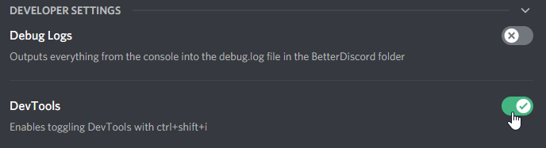
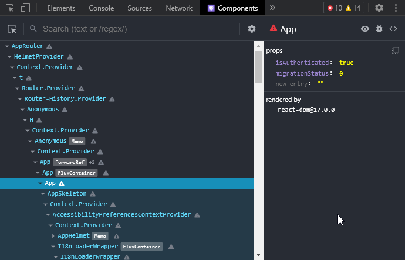
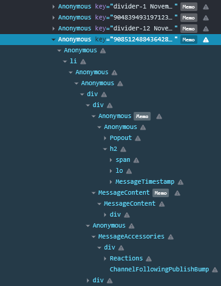
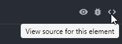
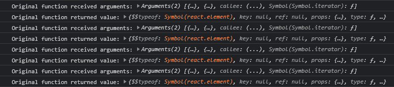

<Banner type="warn" bold>

This article assumes you are familiar with modern [JavaScript](https://developer.mozilla.org/en-US/docs/Web/JavaScript)
like [Arrow functions](https://developer.mozilla.org/en-US/docs/Web/JavaScript/Reference/Functions/Arrow_functions),
[Destructuring](https://developer.mozilla.org/en-US/docs/Web/JavaScript/Reference/Operators/Destructuring_assignment)
and [Optional Chaining](https://developer.mozilla.org/en-US/docs/Web/JavaScript/Reference/Operators/Optional_chaining)
as well as the [React](https://reactjs.org) UI library!

</Banner>

## Environment
As you may already know, the Discord desktop application uses [Electron](https://www.electronjs.org).
The UI is created using [React](https://reactjs.org) and all of the data is handled by a custom event system and a custom [Flux](https://facebook.github.io/flux/) implementation.
Their source is most likely written in [TypeScript](https://www.typescriptlang.org), however that is mostly irrelevant for plugin development.
Everything is transpiled and then bundled together using [webpack](https://webpack.js.org).

Thanks to being based on [Chromium](https://www.chromium.org/Home), Electron's renderer window has the [Chrome DevTools](https://developer.chrome.com/docs/devtools/).
Since the Discord update on 25 January 2022 they are disabled by default.
You can reenable them in BetterDiscord's developer settings.




Afterwards you can access the dev tools by pressing `Ctrl` + `Shift` + `I` (or `Cmd` + `Opt` + `I` on a Mac).
The dev tools will be **extremely important** for any kind of reverse engineering later on and can be used to experiment in the console.

## React Dev Tools
React Developer Tools extends the regular dev tools with React specific tabs.
If you have debugged a React application before, you should be familiar with them.
They will be very helpful when working with Discord's own React components.

In order to use them in Discord, you will need to have a [Chrome](https://www.google.com/intl/en_us/chrome/) installation on your computer.
Install the [React Developer Tools extension](https://chrome.google.com/webstore/detail/react-developer-tools/fmkadmapgofadopljbjfkapdkoienihi/) from the Chrome Web Store.
Then enable the setting in BetterDiscord's developer settings and the dev tools will automatically be loaded in Discord as well.



## BetterDiscord API
[BetterDiscord](https://betterdiscord.app)'s full API will **not** be covered here in details.
**Read the detailed entry on [Creating Plugins](https://github.com/BetterDiscord/BetterDiscord/wiki/Creating-Plugins) in the wiki of the BetterDiscord repo.**
If you encounter any outdated or unclear parts, you should ask in the [BetterDiscord server](https://discord.gg/0Tmfo5ZbORCRqbAd).

A basic BetterDiscord plugin template could look something like this:

```js
/**
 * @name MyPlugin
 * @author YourName
 * @version 0.1.0
 * @description What the plugin does.
 */

module.exports = class MyPlugin {
    start() {
        // do something on plugin start
    }
    stop() {
        // do something on plugin stop
    }
};
```

BetterDiscord also provides the [`BdApi`](https://github.com/BetterDiscord/BetterDiscord/wiki/Creating-Plugins#bdapi) global, which has a few very helpful things for plugins.
It handles storing & loading plugin data as well as injecting & removing styles (CSS).

The [react](https://www.npmjs.com/package/react) and [react-dom](https://www.npmjs.com/package/react-dom) packages are available as
[`BdApi.React`](https://github.com/BetterDiscord/BetterDiscord/wiki/Creating-Plugins#react) and [`BdApi.ReactDOM`](https://github.com/BetterDiscord/BetterDiscord/wiki/Creating-Plugins#reactdom).
They are the same instances as the ones used by Discord. Always use these and **do not** bundle your own versions.

<Banner type="info" bold>

When using [JSX](https://reactjs.org/docs/introducing-jsx.html) in a plugin, it has to be transpiled.

</Banner>

<CodeTabs names={["JSX", "JS"]}>

```jsx
const {React, ReactDOM} = BdApi;

const MyComponent = () => (
    <div className="foo">
        Hello world!
    </div>
);

ReactDOM.render(someNode, <MyComponent/>);
```

```jsx
const {React, ReactDOM} = BdApi;

const MyComponent = () => React.createElement(
    "div",
    {className: "foo"},
    "Hello World!"
);

ReactDOM.render(someNode, React.createElement(MyComponent));
```

</CodeTabs>


`ReactDOM` will not see much use in actual plugins, since most of the time you are rendering into already existing React element trees.

In `BdApi` we also find the `BdApi.Patcher`, which is used to modify existing functions at runtime.
The [`BdApi.monkeyPatch()`](https://github.com/BetterDiscord/BetterDiscord/wiki/Creating-Plugins#monkeypatchmodule-methodname-options) function is the **old** version kept for backwards compatibility.
As of January 2022, the Patcher itself is not documented as part of the BetterDiscord API yet.
However, it uses the same interface as the [Zere's Plugin Library Patcher](https://rauenzi.github.io/BDPluginLibrary/docs/module-Patcher.html)
and the there are [JSDoc](https://jsdoc.app) comments in the [source](https://github.com/BetterDiscord/BetterDiscord/blob/main/renderer/src/modules/patcher.js).
More details on patching will follow later on.

Lastly, `BdApi` features a few functions used to search through the webpack export cache.
We will take a closer look at those next.

## Webpack modules
[Webpack](https://webpack.js.org) is a **bundler**, meaning at its core it is a tool to take a collection of JS modules and merge them together into one or multiple big files for production.
A module may import other modules and then expose some exports of its own.
In order to avoid executing the modules multiple times, webpack keeps exports of already executed modules in a cache.

`BdApi` provides us with a few functions allowing us to search through this export cache in order to find variables, functions, objects or React components internally used by Discord:

[`BdApi.findModule(filter)`](https://github.com/BetterDiscord/BetterDiscord/wiki/Creating-Plugins#findmodulefilter)  
[`BdApi.findAllModules(filter)`](https://github.com/BetterDiscord/BetterDiscord/wiki/Creating-Plugins#findallmodulesfilter)  
[`BdApi.findModuleByProps(...props)`](https://github.com/BetterDiscord/BetterDiscord/wiki/Creating-Plugins#findmodulebypropsprops)  
[`BdApi.findModuleByDisplayName(name)`](https://github.com/BetterDiscord/BetterDiscord/wiki/Creating-Plugins#findmodulebydisplaynamename)  
[`BdApi.findModuleByPrototypes(...protos)`](https://github.com/BetterDiscord/BetterDiscord/wiki/Creating-Plugins#findmodulebyprototypesprotos)

When trying to hook into Discord's internals, searching for the relevant webpack modules is the first step.
This may involve reading Discord's source code, inspecting components through React dev tools, experimenting in the console etc.

<Banner type="warn" bold>

Details in the following examples may be outdated.
Discord's internals can change at any time.

</Banner>

As an example, we will use Discord's message component.
Inspecting with React dev tools makes us realize a message consists of multiple components.
One parent component is responsible for rendering child components like the header, the content or accessories like reactions.



You can inspect a components source by clicking on the `<>` in React dev tools:



Here is a rough overview of the source code of the module containing the parent component:

```js
(e, t, n) => {
    "use strict";
    Object.defineProperty(t, "__esModule", {
        value: !0
    });

    t.ThreadStarterChatMessage = function(e) {
        /* component source... */
    };
    t.default = void 0;
    t.getElementFromMessageId = function(e, t) {
        /* function source... */
    };

    var r, o = /* React import */, /* other imports... */;

    /* other not exported functions/components... */

    var J = o.memo(function(e) { // OUR COMPONENT
        /* component source... */
    });
    t.default = J
}
```

Our component is the anonymous function component inside of the `o.memo()` call.
As we can see, it is wrapped inside of a [React memo](https://reactjs.org/docs/react-api.html#reactmemo) and then exported as default export from its module.
The module also has two other named exports: a `ThreadStarterChatMessage` component and a `getElementFromMessageId()` function.

Knowing this, we can now formulate a predicate to find the module's exports in webpack's cache using `BdApi`.
We want a module whose exports have a `default`, `ThreadStarterChatMessage` and `getElementFromMessageId` entry.

```js
BdApi.findModule((exports) => exports.default && exports.ThreadStarterChatMessage && exports.getElementFromMessageId);
```

This type of predicate is exactly what [`BdApi.findModuleByProps(...props)`](https://github.com/BetterDiscord/BetterDiscord/wiki/Creating-Plugins#findmodulebypropsprops) can be used for:
it searches for a module with the passed string arguments as properties/keys.
An equivalent version would look like:

```js
const Message = BdApi.findModuleByProps("default", "ThreadStarterChatMessage", "getElementFromMessageId");
```

When formulating predicates you have to consider how specific it should be.
When being very specific you are unlikely to accidentally find a different module that also matches the predicate.
However, a very specific predicate may also break very fast when Discord changes something in their internals.

Feel free to explore Discord's modules using the `BdApi` and the dev tools.
You do not always have to start with the UI layer and then navigate through source code until you find what you were looking for.
Sometimes taking a shot in the dark with your searches can help finding the right module as well.
For example, we could do a generic search for all modules exporting something with `"friend"` in the key:

```js
BdApi.findAllModules((exports) => Object.keys(exports).some((key) => key.toLowerCase().includes("friend")))
```

This example will **not** work if what we are looking for is not directly exported from the module as either a key of the default export or a named export.
For example the relationships store will not be included in the output since it is a class instance
and the `isFriend()` method is defined on its [prototype](https://developer.mozilla.org/en-US/docs/Learn/JavaScript/Objects/Object_prototypes).
[`Object.keys()`](https://developer.mozilla.org/en-US/docs/Web/JavaScript/Reference/Global_Objects/Object/keys) simply will not include the method.
If we know we are looking for a store instance, we could search through the keys of the prototype instead:

```js
BdApi.findAllModules((exports) => {
    const proto = Object.getPrototypeOf(exports);
    return Object.keys(proto).some((key) => key.toLowerCase().includes("friend"));
})
```

## Patching
With the module found, we can now hook into the component.
This is done using the already mentioned `BdApi.Patcher`.
It allows us to change the behaviour of existing functions at runtime, executing our own code before, after or instead of the original.
This is commonly referred to as *"monkey patching"* or simply *"patching"*.

There is three different kinds of patches the `BdApi.Patcher` offers.
Typically, you will use `before` patches when you want to intercept and manipulate the incoming function arguments,
`after` patches when you want to intercept and manipulate the resulting return value
and `instead` patches when the behaviour should be changed completely or for other complex scenarios.

In React components you typically want to modify the return value of the original in order to change or add the elements rendered onscreen.
This means we want to create an `after` patch.

Remember: in our case the function component is wrapped inside a [React memo](https://reactjs.org/docs/react-api.html#reactmemo).
We will simply leave the memo as it is and patch the contained function component.

```js
const Message = BdApi.findModuleByProps("default", "ThreadStarterChatMessage", "getElementFromMessageId");

BdApi.Patcher.after("MyPluginName", Message.default, "type", (thisObject, arguments, returnValue) => {
    console.log("Original function received arguments:", arguments);
    console.log("Original function returned value:", returnValue);
});
```

After the component has been patched, we still need to trigger a rerender.
In this case swapping channels will take care of it for us.
We should see output being logged into the console for each message that renders onscreen.



The first argument received is the component props just as you would expect with a function component.
In the case of the message component those consist of the corresponding channel object, message object and some other information.
The second argument is an empty object since the component does not forward any refs.

As to be expected, the return value is what a call to [`React.createElement()`](https://reactjs.org/docs/react-api.html#createelement) returns - a tree of React element nodes.
The most interesting properties on these nodes are `type`, which indicates what kind of element or component this tree node is,
and `props`, which is the props passed to the HTML element or React component.
Child nodes are found under `props.children`.

If we want to render our own elements somewhere, we have to find the node we want to append them to.
This can be done by using tree/graph traversal algorithms like [DFS](https://en.wikipedia.org/wiki/Depth-first_search) or [BFS](https://en.wikipedia.org/wiki/Breadth-first_search).
You can find examples of utility functions for tree traversal in [Zere's Plugin Library](https://github.com/rauenzi/BDPluginLibrary/blob/master/src/modules/utilities.js#L122-L165) (DFS)
or [my own plugin repo](https://github.com/Zerthox/BetterDiscord-Plugins/blob/master/dium/utils/react.ts#L6-L29) (BFS).

Assuming we have a `findNodeInTree(tree, predicate)` utility function to search the tree for a specific node, appending new elements could look like this:

<CodeTabs names={["JSX", "JS"]}>

```jsx
BdApi.Patcher.after("MyPluginName", Message.default, "type", (thisObject, [props], returnValue) => {
    const foundNode = findNodeInTree(returnValue, (node) => node?.type === "li");
    if (foundNode) {
        foundNode.props.children = [
            foundNode.props.children,
            <div>
                <span>This channel is</span>
                <span>{props.channel.isPrivate() ? "private" : "not private"}</span>
            </div>
        ];
    } else {
        console.error("node was not found");
    }
});
```

```jsx
BdApi.Patcher.after("MyPluginName", Message.default, "type", (thisObject, [props], returnValue) => {
    const foundNode = findNodeInTree(returnValue, (node) => node?.type === "li");
    if (foundNode) {
        foundNode.props.children = [
            foundNode.props.children,
            React.createElement("div", {},
                React.createElement("span", {}, "This chanel is"),
                React.createElement("span", {}, props.channel.isPrivate() ? "private" : "not private"),
            )
        ];
    } else {
        console.error("node was not found");
    }
});
```

</CodeTabs>


Remember to undo the patches you did in `start()` when your plugin is stopped:

```js
stop() {
    BdApi.Patcher.unpatchAll("MyPluginName");
}
```

## Further information
Hopefully this helped you a bit while getting started with developing BetterDiscord plugins and using Discord's internals.
Make sure to check the [BetterDiscord wiki](https://github.com/BetterDiscord/BetterDiscord/wiki/) for information on BetterDiscord's API.
Reading the source code of other plugins can also help a lot when learning.
*(Maybe not plugins using `BDFDB` by DevilBro as they can be difficult to read.)*

React's internals and the React fiber have not been touched here at all, but may be interesting for plugin development in some cases.
Same thing goes for Discord's internal state management system using event dispatching and Flux.

If you have any questions, the `#programming` channel in the [BetterDiscord server](https://discord.gg/0Tmfo5ZbORCRqbAd) is the place to ask.
