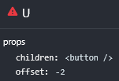
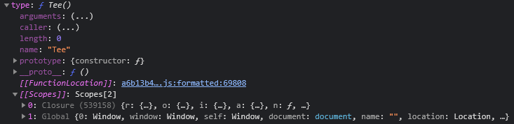

This guide is supposed to act as an introduction to plugin development for the [Discord](https://discord.com) client modification [BetterDiscord](https://betterdiscord.app).
It mostly focuses on covering topics that are not covered by other resources, like monkey patching or webpack internals.

<Banner type="warn">
    This article assumes you are familiar with modern [JavaScript](https://developer.mozilla.org/en-US/docs/Web/JavaScript)
    like [Arrow functions](https://developer.mozilla.org/en-US/docs/Web/JavaScript/Reference/Functions/Arrow_functions),
    [Destructuring](https://developer.mozilla.org/en-US/docs/Web/JavaScript/Reference/Operators/Destructuring_assignment)
    and [Optional Chaining](https://developer.mozilla.org/en-US/docs/Web/JavaScript/Reference/Operators/Optional_chaining)
    as well as the [React](https://reactjs.org) UI library!
    You can read up on these in [The Modern JavaScript Tutorial](https://javascript.info) and [Learn React](https://beta.reactjs.org/learn).
</Banner>

## Environment

The Discord desktop application uses [Electron](https://www.electronjs.org).
Note that plugins run in [Electron's renderer process](https://www.electronjs.org/docs/latest/tutorial/process-model#the-renderer-process).
This means our environment is a **browser not [Node.js](https://nodejs.org)!**.
As of September 2022, BetterDiscord polyfills a small subset of absolutely necessary functions in modules shipped with Node.
However, this is far from exhaustive.

The UI is created using [React](https://reactjs.org) and all of the data is handled by a custom event system and a custom [Flux](https://facebook.github.io/flux/) implementation.
Discord's source code is written in [TypeScript](https://www.typescriptlang.org), however that is mostly irrelevant for plugin development.
Everything is transpiled with [SWC](https://swc.rs) and then bundled together using [webpack](https://webpack.js.org).

Thanks to being based on [Chromium](https://www.chromium.org/Home), Electron's renderer window has the [Chrome DevTools](https://developer.chrome.com/docs/devtools/).
Since the Discord update on 25 January 2022 they are disabled by default.
You can reenable them in BetterDiscord's developer settings.


Afterwards you can access the dev tools by pressing `Ctrl` + `Shift` + `I` (or `Cmd` + `Opt` + `I` on a Mac).
The dev tools will be **extremely important** for any kind of reverse engineering later on and can be used to experiment in the console.

## React Dev Tools

React Developer Tools extends the regular dev tools with React specific tabs.
If you have debugged a React application before, you should be familiar with them.
They will be very helpful when working with Discord's own React components.

In order to use them in Discord, you will need to have a [Chrome](https://www.google.com/intl/en_us/chrome/) installation on your computer.
Install the [React Developer Tools extension](https://chrome.google.com/webstore/detail/react-developer-tools/fmkadmapgofadopljbjfkapdkoienihi/) from the Chrome Web Store.
*(As an alternative manually mimicking the folder structure and placing the extension files in there will also suffice.)*
Then enable the setting in BetterDiscord's developer settings and the dev tools will automatically be loaded in Discord as well.


<Banner type="warn">
    Since version 4.27.0 React Developer Tools has [issues with Chromium versions older than 102](https://github.com/facebook/react/tree/main/packages/react-devtools#the-issue-with-chrome-v101-and-earlier).
    As of December 2022, Discord stable is on 91 and Canary is on 98.
</Banner>

## BetterDiscord API
BetterDiscords full API will **not** be covered here in details.
You can find additional information in the [BetterDiscord documentation](https://docs.betterdiscord.app/) (some parts work in progress). 
If you encounter any outdated or unclear parts, you should ask in the [BetterDiscord server](https://discord.gg/0Tmfo5ZbORCRqbAd).

A basic BetterDiscord plugin could look something like this:

<CodeTabs names={["Class", "Callback"]}>
```js
/**
 * @name MyPlugin
 * @author YourName
 * @version 0.1.0
 * @description What the plugin does.
 */

module.exports = class MyPlugin {
    constructor(meta) {
        // do something when the plugin is loaded
    }
    start() {
        // do something on plugin start
    }
    stop() {
        // do something on plugin stop
    }
};
```

```js
/**
 * @name MyPlugin
 * @author YourName
 * @version 0.1.0
 * @description What the plugin does.
 */

module.exports = (meta) => {
    // do something when the plugin is loaded

    return {
        start() {
            // do something on plugin start
        },
        stop() {
            // do something on plugin stop
        }
    };
};
```
</CodeTabs>

BetterDiscord also provides the [`BdApi`](https://docs.betterdiscord.app/api/bdapi) global, which has a few very helpful things for plugins.
It handles storing & loading plugin data as well as injecting & removing styles (CSS).

The [react](https://www.npmjs.com/package/react) and [react-dom](https://www.npmjs.com/package/react-dom) packages are available as
[`BdApi.React`](https://docs.betterdiscord.app/api/bdapi#react) and [`BdApi.ReactDOM`](https://docs.betterdiscord.app/api/bdapi#reactdom).
They are the same instances as the ones used by Discord. Always use these and **do not** bundle your own versions.

<Banner type="info">When using [JSX](https://reactjs.org/docs/introducing-jsx.html) in a plugin, it has to be transpiled.</Banner>

<CodeTabs names={["JSX", "JS"]}>
```jsx
const { React } = BdApi;

const MyComponent = () => (
    <div className="foo">
        Hello world!
    </div>
);
```

```jsx
const { React } = BdApi;

const MyComponent = () => React.createElement(
    "div",
    { className: "foo" },
    "Hello World!"
);
```
</CodeTabs>

`ReactDOM` will not see much use in actual plugins, since most of the time you are rendering into already existing React element trees.

In `BdApi` we also find the [`BdApi.Patcher`](https://docs.betterdiscord.app/api/patcher), which is used to modify existing functions at runtime.
More details on patching will follow later on.

Lastly, [`BdApi.Webpack`](https://docs.betterdiscord.app/api/webpack) features a few utilities used to search through the webpack export cache.
We will take a closer look at this next.

## Webpack modules

[Webpack](https://webpack.js.org) is a **bundler**, meaning at its core it is a tool to take a collection of JS modules and merge them together into one or multiple big files for production.
A module may import other modules and then expose some exports of its own.
In order to avoid executing the modules multiple times, webpack keeps exports of already executed modules in a cache.

[`BdApi.Webpack`](https://docs.betterdiscord.app/api/webpack) allows us to search through this export cache
in order to find variables, functions, objects or React components internally used by Discord.
[`Webpack.getModule(filter, options)`](https://docs.betterdiscord.app/api/webpack#getmodule) takes a filter function and searches through the exports of all currently cached modules.

[`Webpack.Filters`](https://docs.betterdiscord.app/api/filters) contains helpers to create commonly used search filter patterns.
[`Filters.byProps(...props)`](https://docs.betterdiscord.app/api/filters#byprops) possibly should have been named something like `byKeys` instead,
since people tend to confuse it with React's Component props.
It has nothing to do with React's props, it searches for specific properties (keys) in `module.exports`.
[`Filters.byDisplayName(name)`](https://docs.betterdiscord.app/api/filters#bydisplayname) searches for a specific `displayName` set on the object.
[`Filters.byStrings(...strings)`](https://docs.betterdiscord.app/api/filters#bystrings) is best explained as something similar to `target.toString().includes(...)`.

When trying to hook into Discord's internals, searching for the relevant webpack modules is the first step.
This may involve reading Discord's source code, inspecting components through React dev tools, experimenting in the console etc.

The Discord update on 27 September 2022 brought some major changes to characteristics of their production code.
Named top-level exports have had their names "mangled" (minified).
The module merging also became more aggressive, merging e.g. all of the channel list components into a single module.
These changes pose **additional challenges when searching modules**.

## Finding a component

<Banner type="warn">Details in the following examples may be outdated. Discord's internals are undocumented and can change at any time.</Banner>

As a first example, we will attempt to find Discord's button component in their webpack modules.
When inspecting in React devtools, the first component we stumble upon is called `U`.
Looking at its received props, we realize this cannot be the component we are looking for:
it is receiving the element as children, meaning those were rendered by one of its parents!



Going up to the direct parent we find component `y`, which is the component we are looking for.
We inspect its source and click the pretty print button in oder to see what we are working with.


This brings us to something similar to:

```js
var y = function (e) {
    var t = e.look,
        n = void 0 === t ? m.FILLED : t,
        i = e.color,
        u = void 0 === i ? T.BRAND : i,
        _ = e.borderColor,
        O = e.hover,
        v = e.size,
        y = void 0 === v ? g.MEDIUM : v,
        /* other props... */;
    // local vars, hooks...
    var ie = (0, r.jsx)(s.tE, /* react elements... */);
    if (te) {
        // alternative return...
    }
    return ie;
}
y.Looks = m;
y.Colors = T;
y.BorderColors = O;
y.Hovers = v;
y.Sizes = g;
y.Link = function (e) {
    // component source...
};
const A = y;
```

Going up to the top of the module, we find that our component is exported directly (line 9):

```js
191940: (e, t, n) => {
    "use strict";
    n.d(t, {
        iL: () => m,
        Tt: () => T,
        lN: () => v,
        Ph: () => g,
        nY: () => S,
        Co: () => A
    });
```

To explain the codeblock above: it starts with a key in an object literal, which is the id of the module.
The following value is the module function holding the module's code.
When evaluating the module webpack will pass its own versions of `module`, `module.exports`, `require` as arguments in this order.
`require.d` is a helper to define getters.

Jumping back to the button component itself, we will take a look at two approaches for retrieving it.
We do so by formulating a search predicate in order to match it within webpack's export cache.

When formulating predicates you have to consider how specific it should be.
When being very specific you are unlikely to accidentally find a different module that also matches the predicate.
However, a very specific predicate may also break very fast when Discord changes something in their internals.
You can check how many potentially wrong modules your predicate currently matches by passing `first: false` to `getModule()`.

Our first approach is the currently most common way to build search predicates for components.
We do not any have export names or component `displayName`s to work with.
However, the component possibly still accesses the React component props it recieves.
We can use these to create a predicate using [`Filters.byStrings(...strings)`](https://docs.betterdiscord.app/api/filters#bystrings).
Looking at the component source, we can figure out which accesssed props could be a suitable for our query.

In this case `submittingStartedLabel` and `submittingFinishedLabel` are two props with fairly specific names, which are accessed within the component.
And indeed, we only get a single match using either of them:

```js
getModule(Filters.byStrings("submittingStartedLabel"), { searchExports: true, first: false })
```

If we are afraid these props are too special and might be removed from the component in the future, we can combine multiple of the more "basic" props.
The query below returns 12 matches:

```js
getModule(Filters.byStrings("look", "submitting"), { searchExports: true, first: false })
```

One thing we can change is to add the `.` from accessing the property in front.
Discord's toolchain (usually) transpiles destructuring props into regular property access operations.
This cuts down our number of matches to 2:

```js
getModule(Filters.byStrings(".look", ".submitting"), { searchExports: true, first: false })
```

We can also take a look at the "wrong" matches and attempt to find code fragments that are present in our component but not the others.
In this case the other component for example does not access an `onClick` prop, leaving us with this possible query for the button component:

```js
const Button = getModule(Filters.byStrings(".look", ".submitting", ".onClick"), { searchExports: true });
```

Our second approach for finding the button component can only be applied in special cases.
Looking at our component source code again, we happen to have a handful of assignments right below our function component.
These add enum-like objects and another associated function component.
Knowing this, we can attempt to use [`Filters.byProps(...props)`](https://docs.betterdiscord.app/api/filters#byprops) and match these properties instead of matching the component source:

```js
const Button = getModule(Filters.byProps("Link", "Colors"), { searchExports: true });
```

If a component or function is **not exported** from its module, things become a lot more complicated.
More advanced techniques like chain patching or dummy rendering plus traversing React fiber will be required.

## Finding a store

Discord uses the [Flux](https://facebook.github.io/flux) architecture to organize their data.
You can read more about this in [Flux and Discord](../flux).
In the Flux architecture *Stores* hold all of the relevant state information.

As an example, we will attempt to find the `UserStore`.
As our entry point for reverse engineering we pick the component responsible for rendering the account panel below the channel list.
We start by searching through the component tree for a component which does not receive the data as props from a parent.
This brings us to a component called `Tee`:

```js
function Tee() {
    var e = (0, s.e7)([Y.default], (function() {
            return Y.default.getCurrentUser()
        })),
        // some other variables...
        a = null == e ? void 0 : e.id,
        l = He.Ok.useSetting(),
        c = o.useMemo((function() {
            return null != l ? (0,
            Z8.Z)(l) : null
        }), [l]),
        u = (0, s.cj)([Hc.Z], (function() {
            return {
                streaming: null != Hc.Z.findActivity((function(e) {
                    return e.type === Z.IIU.STREAMING
                }
                )),
                status: Hc.Z.getStatus()
            }
        })),
        f = u.streaming
        d = u.status
        p = (0, s.e7)([oy.Z], (function() {
            return null != a && oy.Z.isSpeaking(a)
        }), [a]),
    // rest...
}
```

There is a fairly obvious call to `getCurrentUser()` in there.
But let's figure out what the rest around it is.

We can take a closer look at the component by selecting it in React devtools and typing `$r` in console.
The `type` will contain the function, which we can help us figure out what values captured variables contain.
If we expand the function, we see a `[[Scopes]]` entry at the bottom.
We can look through these manually or in case one scope of captured variables is very large:
right click, store as global variable and then access an entry like `temp1.object.s`.



Another helpful technique to help with reverse engineering is to set a breakpoint near the end of the function/component.
Then attempt to trigger a call/rerender.
When the breakpoint is hit, we can take a look at which values captured as well as local variables hold.

It turns out our captured variable `s` is Discord's Flux module.
And the functions `s.e7` and `s.cj` are the mangled `useStateFromStores` and `useStateFromStoresObject` hooks.
`Y.default` is the store we are searching.
(Yes, big surprise...)
Besides `getCurrentUser` we for example also find the functions `getUsers`, `getUser` or `findByTag` there.

<CodeTabs names={["Production code", "Reverse engineered"]}>
```js
var e = (0, s.e7)([Y.default], (function() {
        return Y.default.getCurrentUser()
    })),
    a = null == e ? void 0 : e.id;
```

```js
const currentUser = Flux.useStateFromStores([UserStore], () => {
    return UserStore.getCurrentUser();
});
const id = currentUser?.id;
```
</CodeTabs>

Looking at our store, we can easily grab it using [`Filters.byProps(...props)`](https://docs.betterdiscord.app/api/filters#byprops).
Since it is exported as `default` export from its module, we do not need `searchExports: true`.
BetterDiscord checks our filter on both the whole exports object as well the default export by default.
Since using `"getUser"` or `"getCurrentUser"` on their own gives us more than 1 match, we combine them:

```js
const UserStore = getModule(Filters.byProps("getUser", "getCurrentUser"));
```

Alternatively, we can grab the store by its name:
```js
const UserStore = getModule((exports) => exports?.constructor?.displayName === "UserStore");
```
```js
const UserStore = getModule((exports) => typeof exports?.getName === "function" && exports.getName() === "UserStore");
```

## Patching

Now that we know how to find modules, we can take a look at how we can hook into a function exported by one.
This is done using the already mentioned [`BdApi.Patcher`](https://docs.betterdiscord.app/api/patcher).
It allows us to change the behaviour of existing functions at runtime, executing our own code before, after or instead of the original.
This is commonly referred to as *monkey patching* or simply *patching*.

There is three different kinds of patches the [`BdApi.Patcher`](https://docs.betterdiscord.app/api/patcher) offers.
Typically, you will use [`before`](https://docs.betterdiscord.app/api/patcher/#before) patches when you want to intercept and manipulate the incoming function arguments,
[`after`](https://docs.betterdiscord.app/api/patcher/#after) patches when you want to intercept and manipulate the resulting return value
and [`instead`](https://docs.betterdiscord.app/api/patcher/#instead) patches when the behaviour should be changed completely or for other complex scenarios.

In React components you typically want to modify the return value of the original in order to change the elements rendered.
This means we want to create an `after` patch.
For class components the target function is `Component.prototype.render()` usually.
For function components it is the component itself.

Note that the patcher expects an **object** containing the target function and the **key** of the function entry.
You may have to adjust your filter and/or use `defaulExport: false` when searching with the intent to patch.

```js
const myComponentModule = getModule(/* filter */);

Patcher.after("MyPluginName", myComponentModule, "myComponentKey", (thisObject, originalArgs, returnValue) => {
    console.log("Original function received arguments:", originalArgs);
    console.log("Original function returned value:", returnValue);
});
```

After the component has been patched, we still need to trigger a rerender.
We should see output being logged into the console for each instance of the patched component that renders onscreen.


The example above is output from a function component.
The first argument received is the component props just as you would expect with a function component.
The second argument is an empty object since the component does not forward any refs (or makes use of React's legacy context API).

As to be expected, the return value is what a call to [`React.createElement()`](https://reactjs.org/docs/react-api.html#createelement) returns - a tree of React element nodes.
The most interesting properties on these nodes are `type`, which indicates what kind of element or component this tree node is,
and `props`, which is the props passed to the HTML element or React component.
Child nodes are found under `props.children`.

If we want to render our own elements somewhere, we have to find the node we want to append them to.
This can be done by using tree/graph traversal algorithms like [DFS](https://en.wikipedia.org/wiki/Depth-first_search) or [BFS](https://en.wikipedia.org/wiki/Breadth-first_search).
You can find examples of utility functions for tree traversal in [`BdApi.Utils`](https://docs.betterdiscord.app/api/utils#findintree) (DFS),
[Zere's Plugin Library](https://github.com/rauenzi/BDPluginLibrary/blob/master/src/modules/utilities.js#L122-L165) (DFS)
or [my own plugin repo](https://github.com/Zerthox/BetterDiscord-Plugins/blob/069cac71f1129fc5ca29af46cf7a50675b87cf03/dium/src/utils/react.ts#L36-L59) (BFS).

With a utility function to search the tree for a specific node, appending new elements could look like this:

<CodeTabs names={["JSX", "JS"]}>
```jsx
const findInReactTree = (tree, filter) => Utils.findInTree(tree, filter, {walkable: ["props", "children"]});

Patcher.after("MyPluginName", myComponentModule, "myComponentKey", (thisObject, [props], returnValue) => {
    const foundNode = findInReactTree(returnValue, (node) => node?.type === "li");
    if (foundNode) {
        foundNode.props.children = [
            foundNode.props.children,
            <div>My elements</div>
        ];
    } else {
        console.error("node was not found");
    }
});
```

```jsx
const findInReactTree = (tree, filter) => Utils.findInTree(tree, filter, {walkable: ["props", "children"]});

Patcher.after("MyPluginName", myComponentModule, "myComponentKey", (thisObject, [props], returnValue) => {
    const foundNode = findInReactTree(returnValue, (node) => node?.type === "li");
    if (foundNode) {
        foundNode.props.children = [
            foundNode.props.children,
            React.createElement("div", {}, "My elements")
        ];
    } else {
        console.error("node was not found");
    }
});
```
</CodeTabs>


Remember to undo the patches you did in `start()` when your plugin is stopped:

```js
stop() {
    Patcher.unpatchAll("MyPluginName");
}
```

## Further information

Hopefully this helped you a bit while getting started with developing BetterDiscord plugins and using Discord's internals.
Make sure to check the [BetterDiscord documentation](https://docs.betterdiscord.app/) for information.
Reading the source code of other plugins can also help a lot when learning.
*(Maybe not plugins using `BDFDB` by DevilBro as they can be difficult to read.)*

React's internals and the React fiber have not been touched here at all, but may be interesting for plugin development in some cases.
Same thing goes for Discord's internal state management system using event dispatching and Flux.

If you have any questions, the `#programming` channel in the [BetterDiscord server](https://discord.gg/0Tmfo5ZbORCRqbAd) is the place to ask.
